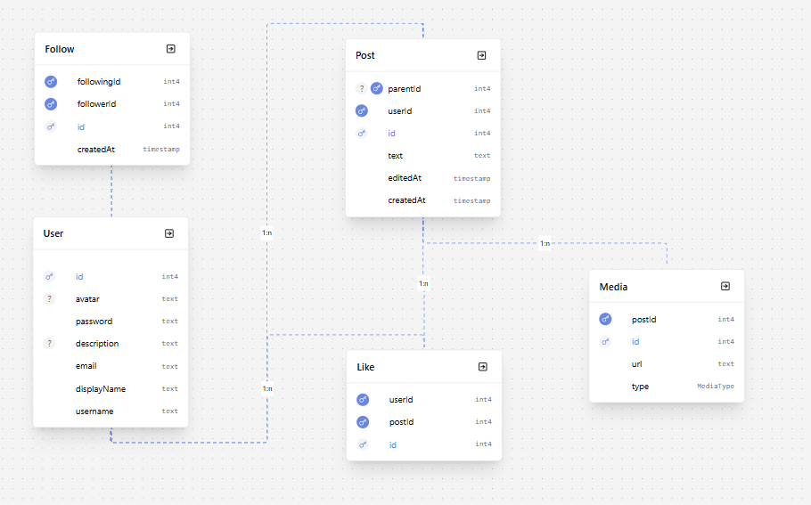

# Social Networking Platform

A social networking platform that enables users to create posts, interact through likes and comments, and build personalized content feeds through following relationships. The system supports both global and personalized feeds, user profiles with activity history, and content visibility based on social connections and access rules.


## Architecture & Tech Stack

The project is split into two main parts: a backend service and a frontend client.

The backend is built with Node.js, Express, and TypeScript. It handles authentication, posts, social interactions (likes and comments), follow system logic, and database operations through Prisma with PostgreSQL. It also manages access control and content visibility rules.

The frontend is built with React and TypeScript using Vite. It provides the user interface for feeds, user profiles, post interactions, and navigation between global and personalized content views. Client-side routing is handled with React Router.


## Key Features

- Create, edit, and delete posts with text and media attachments (images/videos)
- Like and comment system for user interaction with posts
- Follow/unfollow functionality to build personalized social connections
- Global feed with all platform content
- Personalized feed based on followed users
- Threaded conversations through post replies
- User profiles with activity history and customizable information
- Role-based access control for guests and authenticated users
- Search functionality for users and posts


## Core Entities

The system is built around a social graph model that supports posts, interactions, media content, and user relationships.

**User** represents a registered account in the platform. Each user has profile information such as username, display name, avatar, and optional description. Users can create posts, like content, and follow other users to build a personalized feed. Account verification is required for full platform access.

**Post** is the central content unit of the system. It contains text content and supports multiple interaction types including replies, likes, and reposts. Posts can form threaded conversations through parent-child relationships and can also include attached media such as images or videos.

**Like** represents a user interaction with a post. It connects a user and a post in a many-to-many relationship and ensures uniqueness so that a user can like a post only once.

**Follow** defines the social graph between users. It connects a follower and a following user, enabling personalized feeds and content visibility based on relationships.

**Media** represents attachments linked to posts. It supports different media types such as images and videos and stores external URLs for content delivery.


## Database Overview



## Getting Started
To run the project locally, start by cloning the repository and installing dependencies in both frontend and backend directories.

Before starting the application, install backend dependencies and generate the Prisma client:

```bash
npx prisma generate
```

Then configure environment variables in the backend. Rename .env.example to .env and fill in all required values:

FRONTEND_LINK=

DATABASE_URL=

JWT_SECRET_KEY=

CLOUDINARY_CLOUD_NAME=

CLOUDINARY_API_KEY=

CLOUDINARY_API_SECRET=


These variables are required for database connection, authentication, and file storage integration.

After environment setup, start both parts of the application in separate terminals:

Backend:

```bash
cd backend
npm run dev
```

Frontend:

```bash
cd frontend
npm run dev
```